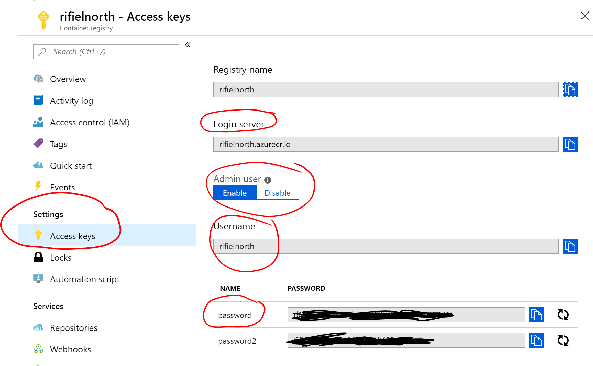
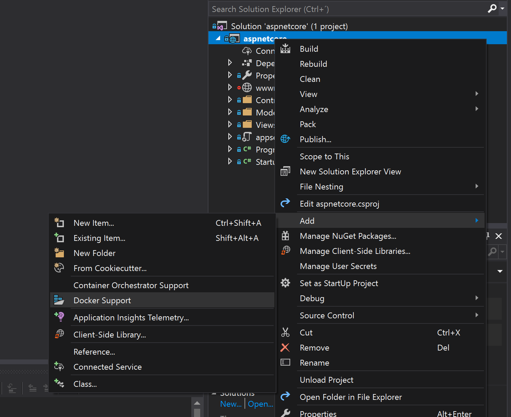
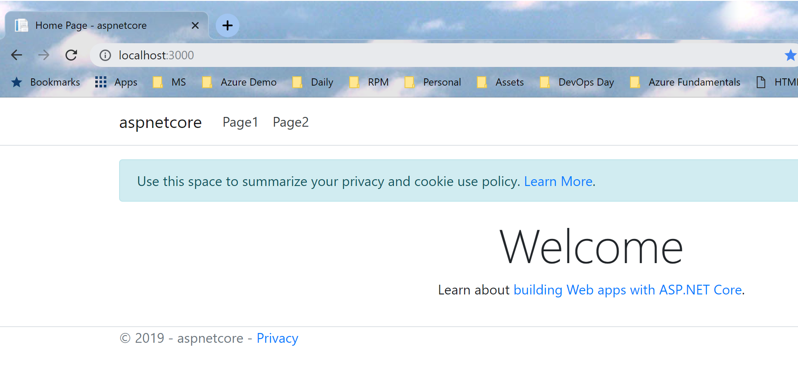
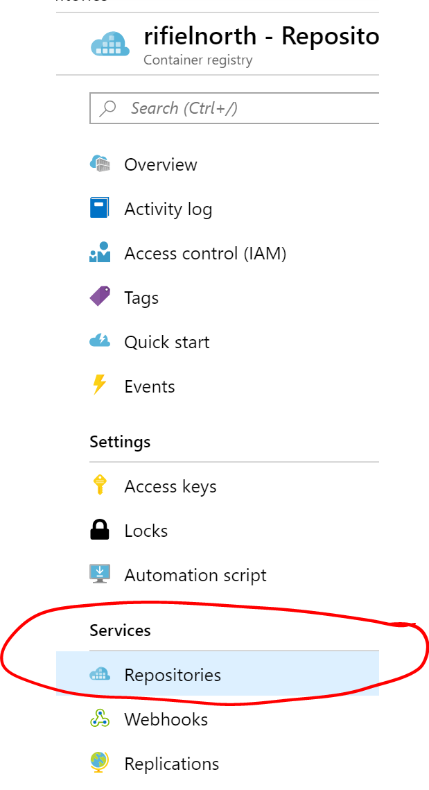
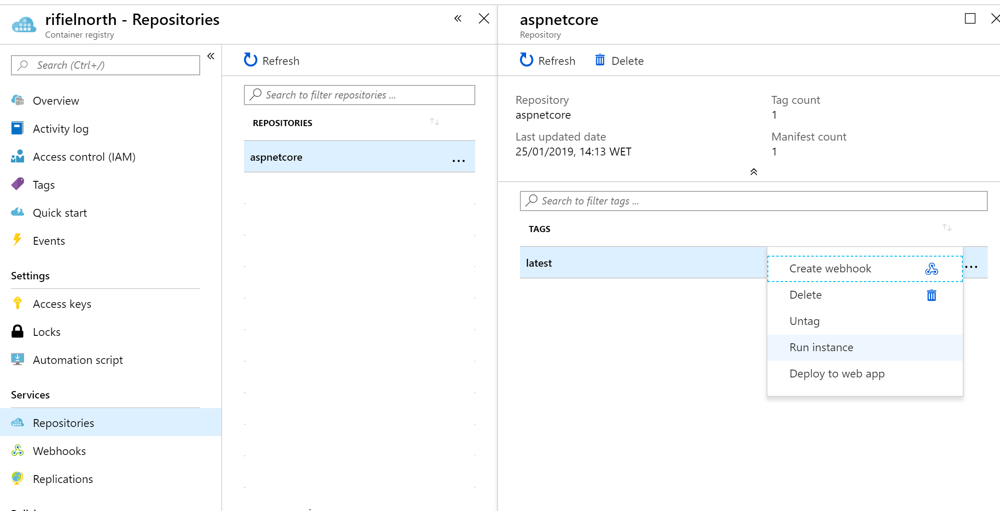
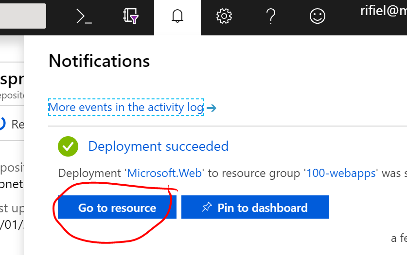

Add Docker with Linux containers to an existing app, then deploy to Azure Container Instances and App Service.

Lab Time: 1 hour max

# Pre-requisites

* Azure Subscription
* Visual Studio Code 
* Docker Desktop

# Lab Steps

## Provision a container registry 
1. Create an Azure Container Registry instance by [following this tutorial](https://docs.microsoft.com/en-us/azure/container-registry/container-registry-get-started-portal). This is where we'll store the Docker images we create.

2. Once created, go to Settings -> Access Keys and take note of the following (see screenshots below):
- Login Server
- Make sure "Admin User" is enabled
- Username
- Password



## Open an application in Visual Studio Code

1. [Download this repo](https://github.com/theplastictoy/appmod-labs/archive/master.zip) and extract files to a folder on your computer

1. Navigate to the [src/aspnetcore](/src/aspnetcore) folder in your machine and open Visual Studio Code by typing `code .` to launch it. This is a sample ASP.NET Core application.

2. Add Docker Support and choose Linux Containers. You can do this by right-clicking the project file. More info available in [our docs site](https://docs.microsoft.com/en-us/aspnet/core/host-and-deploy/docker/visual-studio-tools-for-docker?view=aspnetcore-2.2#existing-app).



## Build and run a container locally

3. Build a docker image by typing `docker build -t aspnetcore .`

4. Run the project locally by typing `docker run --rm -p 3000:80 aspnetcore` You should see the app running in http://localhost:3000. The `-p 3000:80` arg maps port 3000 of the host to port 80 of the container.



## Push the image to Azure Container Registry

1. Tag the image for ACR by typing `docker tag aspnetcore (loginserver)/aspnetcore` **replacing (loginserver)** with **YOUR** registry. You should now have something like `rifielnorth.azurecr.io/aspnetcore`

2. Authenticate docker cli to ACR: `docker login -u (username) -p (password) (loginserver)` using the values for **YOUR** registry.

3. Push the image by typing `docker push (loginserver)/aspnetcore`

Navigate to your ACR via the Azure Portal and go to Services -> Repositories.



## Deploy the application to Azure Container Instances

1. Choose the aspnetcore repository

2. In the latest tag, click ... and select "Run instance"



3. Use the values below and leave everything else unchanged: 
- Container name: aspnetcore
- Resource Group: use the same as the one where ACR is located
- Location: use the same where ACR is located

Once the container instance is done provisioning, navigate to it, get the IP address and open it in a browser.


## Deploy the application to Azure App Service

1. Navigate back to the aspnetcore repository in ACR

2. This time, choose Deploy to Web App


3. Use the values below and leave everything else unchanged:
- Site name: something **globally** unique (eg: rifiel-aspnetcore)
- Resource Group: same as before
- App Service Plan / Location: create a new plan in the same region as ACR.

Once the App Service is created, go to its overview page and click the 




## Updating the application

1. Open the Views/Home/Index.cshtml file and replace its contents with the one below.

```
@{
    ViewData["Title"] = "Home Page";
}

<div class="text-center">
    <h1 class="display-4">Welcome to Building the Future 2018!</h1>
    <p>Learn about <a href="https://azure.microsoft.com/en-us/services/kubernetes-service/docker/">running Docker containers on Azure</a>.</p>
</div>
```

2. Now build and push the docker image again. You don't need to run it locally.

````
docker build -t (loginserver)/aspnetcore .
docker push (loginserver)/aspnetcore
````

3. Notice that the time to build and push the image is considerably lower. This happens because the required images are cached locally and in ACR.

3. Navigate to the Azure App Service URL and refresh the webpage. You should see the changes live. 

4. This happens because Azure Container Registry creates a webhook that automatically updates App Services when an image is modified.

## Optional exercices

## Further Reading